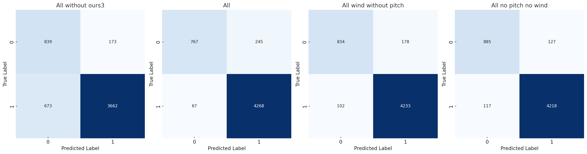

# Drone_Audio_Detection
- [Drone_Audio_Detection](#droneaudiodetection)
  - [Pre-Process, Labeling of Data & Overfitting](#preprocess-labeling-of-data--overfitting)
    - [Dataset](#dataset)
  - [Architecture of CNN](#architecture-of-cnn)
    - [Hyperparameters](#hyperparameters)
  - [Preprocess](#preprocess)
    - [Labeling](#labeling)
    - [Overfitting (optional)](#overfitting-optional)
  - [Training](#training)
  - [Testing](#testing)
    - [Create Test Dataset](#create-test-dataset)
  - [Get Details for Performance](#get-details-for-performance)
  - [Convert model to Raspberry Pi](#convert-model-to-raspberry-pi)
  - [Last step]


- **Requirements**: 
  - pandas, numpy, tensorflow, sklearn, matplotlib, h5py, seaborn, pickle
  - csv, shutil, librosa, scipy, pydub, wave, soundfile 
- **Environment**:
  - conda 24.5.0
  - Python 3.9.19
    - pandas: 2.2.2
    - numpy: 1.26.4
    - tensorflow: 2.17.0
    - scikit-learn (sklearn): 1.5.1
    - matplotlib: 3.9.1
    - h5py: 3.11.0
    - seaborn: 0.13.2
    - librosa: 0.10.2.post1
    - scipy: 1.13.1
    - pydub: 0.25.1
    - soundfile: 0.12.1

To install these dependencies:

```bash
pip install numpy==1.26.4 pandas==2.2.2 scipy==1.13.1 matplotlib==3.9.1 seaborn==0.13.2 h5py==3.11.0 tensorflow==2.17.0 scikit-learn==1.5.1 librosa==0.10.2.post1 pydub==0.25.1 soundfile==0.12.1
git clone https://github.com/kos00pas/Drone_Audio_Detection.git
cd Drone_Audio_Detection
```

## Pre-Process, Labeling of Data & Overfitting  

### Dataset 
1. **SOUND-BASED DRONE FAULT CLASSIFICATION USING MULTI-TASK LEARNING (Version 1)**  
   29th International Congress on Sound and Vibration (ICSV29), Wonjun Yi, Jung-Woo Choi, & Jae-Woo Lee. (2023). Prague. [Zenodo](https://doi.org/10.5281/zenodo.7779574)
   
2. **DREGON**  
   Audio-Based Search and Rescue with a Drone: Highlights from the IEEE Signal Processing Cup 2019 Student Competition. Antoine Deleforge, Diego Di Carlo, Martin Strauss, Romain Serizel, & Lucio Marcenaro. (2019). IEEE Signal Processing Magazine, 36(5), 138-144. Institute of Electrical and Electronics Engineers. [Kaggle](https://www.kaggle.com/datasets/awsaf49/ieee-signal-processing-cup-2019-dataset)

3. **Audio Based Drone Detection and Identification using Deep Learning**  
   Sara A Al-Emadi, Abdulla K Al-Ali, Abdulaziz Al-Ali, Amr Mohamed. [GitHub](https://github.com/saraalemadi/DroneAudioDataset/tree/master)

4. **DronePrint**  
   Harini Kolamunna, Thilini Dahanayake, Junye Li, Suranga Seneviratne, Kanchana Thilakaratne, Albert Y. Zomaya, Aruna Seneviratne. [GitHub](https://github.com/DronePrint/DronePrint/tree/master)

5. **Drone Detection and Classification using Machine Learning and Sensor Fusion**  
   Svanström F. (2020). [GitHub](https://github.com/DroneDetectionThesis/Drone-detection-dataset/tree/master)

6. **DroneNoise Database**  
   Carlos Ramos-Romero, Nathan Green, César Asensio and Antonio J Torija Martinez. [Figshare](https://salford.figshare.com/articles/dataset/DroneNoise_Database/22133411)

7. **ESC: Dataset for Environmental Sound Classification**  
   Piczak, Karol J. [GitHub](https://github.com/karolpiczak/ESC-50)

8. **drone-audio-detection**  
   [GitHub](https://github.com/BowonY/drone-audio-detection/tree/develop)

9. **Our dataset** -> ours, ours_2, ours_3 

10. **Mistakes** -> faults from training  

## Architecture of CNN 
- Input: MFCC features from audio (shape: (40, 32, 1)).
- Output: Probability of classifying the audio as drone or not drone.

```
model = models.Sequential([
    layers.Input(shape=(40, 32, 1)),  # Adding a channel dimension for CNN
    layers.Conv2D(32, (3, 3), activation='relu'),
    layers.BatchNormalization(),
    layers.MaxPooling2D((2, 2)),
    layers.Dropout(0.3),

    layers.Conv2D(64, (3, 3), activation='relu'),
    layers.BatchNormalization(),
    layers.MaxPooling2D((2, 2)),
    layers.Dropout(0.3),

    layers.Conv2D(128, (3, 3), activation='relu'),
    layers.BatchNormalization(),
    layers.MaxPooling2D((2, 2)),
    layers.Dropout(0.3),

    layers.Flatten(),
    layers.Dense(128, activation='relu'),
    layers.Dropout(0.3),
    layers.Dense(1, activation='sigmoid')
])
```

### Hyperparameters

- By running `hyperparameters/find_hypr.py`, the optimal parameters were determined to be:
  - `epochs=10`
  - `optimizer='adam'` (with a default learning rate of 0.001)
  - `loss='binary_crossentropy'`
  - `metrics=['accuracy']`


## Preprocess

#### Folder: `Drone_Audio_Detection/pre-process-code`

When you receive a new dataset, pre-process the data in the following order to prepare it for training:

1. **Copy the original data to the root of the repository**:
   - Place it in the `Drone_Audio_Detection` directory.
   - Example: `Drone_Audio_Detection/data_mp3`

2. **Update the `folder_name` in the configuration file**:
   - Modify `Drone_Audio_Detection/pre-process-code/file_with_folder_name.json`
   - Example: `"folder_name": "../data_mp3"`

3. **Convert mp3 files to .wav (if necessary)**:
   - Use `convertion_mp3_wav.py`

4. **Resample the data to a 16kHz sample rate**:
   - Run `resampling.py`

5. **Split the data into 1-second segments**:
   - Use `splitting.py`

6. **Create a directory for each 1-second segment containing**:
   1. `signal.csv` (16000, 1), dtype=np.int16 based on recording of respeaker, dtype: float32
   2. `mfcc.csv` for training the model:
      - Generate with `create_signal_csv.py`
      - Generate with `make_mfcc.py`


### Labeling

#### Folder: `Drone_Audio_Detection/pre-process-code/for_labels`

For each `signal.csv`, create a corresponding `label.csv` with values: `'drone'` or `'not_drone'`.

1. **Gather all paths**:
   - Run `take_paths.py`

2. **Split the paths of drones and not_drones, then save them into folders**:
   - Generate `all_drones.csv` for drone paths.
   - Generate `all_not_drone.csv` for not_drone paths.

3. **Create labels after generating `all_drones.csv` and `all_not_drone.csv`**:
   - Use `make_drone_labels_csv.py`
   - Use `make_not_drone_labels_csv.py`

4. **Verify that all data have corresponding labels**:
   - Run `check_to_all_for_label_csv.py`

5. **Copy the newly labeled data to the directory containing all datasets**:
   - Use `copy_data_to_dataset.py`


### Overfitting (optional)

#### Folder: `Drone_Audio_Detection/overfitting`

1. **Update the `folder_name` in the configuration file**:
   - Modify `Drone_Audio_Detection/overfitting/file_with_folder_name.json`
   - Example: `"folder_name": "../data_mp3"`

2. **Create folders for extra data**:
   - Use `create_noise_folder_n_copy_files.py`

3. **Delete existing MFCC files from the _noise folder to create new ones for each overfitting scenario**:
   - Use `delete_noise_mfcc.py`

4. **Generate `signal.csv` for each _noise folder**:
   - Use `make_signal_noise.py`

5. **Delete the original signal files since new ones are created by `make_signal_noise.py`**:
   - Use `delete_original_signal.py`

6. **Rename signal noise files to signal**:
   - Use `rename_signal_noise_to_signal.py`

7. **Generate `mfcc.csv` for all overfitting data**:
   - Use `make_mfcc.py`


## Training

### Folder: `Create_Dataset_and_train`

- `make_make_mfcc_labels.py`
  - Output: `/mfcc_labels_{folder_name}.csv`
- `saveh5.py`
  - Output: `{folder_name}/train_dataset.h5`, `{folder_name}/val_dataset.h5`, `{folder_name}/test_dataset.h5`
- `loadh5.py`
  - Output: `{folder_name}/trained_model_{folder_name}.keras`, `model12_{folder_name}.weights.h5`, `{folder_name}/history_{folder_name}.pkl`

- **Note**: If you want to create multiple datasets for comparison:
  - Make a new folder, copy the `mfcc_labels<name>.csv` file, and then delete or append data as needed.
  - To delete specific entries, use:
    - `delete_lines_with_string.py`

## Testing

### Create Test Dataset

#### Folder: `create_test_dataset`

- To generate the dataset for testing your model:
  - Use `make_TEST_mfcc_labels.py`:
    - This script appends data from a specified path, e.g., `base_path = '../FINISHED_V7/ours_3'`, to `output_file = 'mfcc_labels.csv'`.
- If you need to remove specific folders from `mfcc_labels.csv`, use:
  - `delete_lines_with_string.py`:
    - Set the `string_to_delete` variable to the string that matches the lines you want to delete.
- To create the `.h5` dataset:
  - Use `create_test_Dataset.v2.py`:
    - This script generates the dataset using data from `labels_file_path = 'mfcc_labels.csv'`.


## Get Details for Performance

#### Folder: `Compare`

- To get the confusion matrix using a testing dataset:
  - In `get_details.py`, add the folder location of the model to the `models_folder_names` variable. The model's folder can be found in the `Create_Dataset_and_train` folder.
- I ran `get_details.py` using our recording as the test dataset and compared various datasets to determine the optimal performance.
- Datasets:

| Model                    | Correct Sum (TP + TN) | False Sum (FP + FN) |
|--------------------------|-----------------------|---------------------|
| All without ours3        | 4501                  | 846                 |
| All                      | 5035                  | 312                 |
| All wind without pitch   | 5067                  | 280                 |
| **all_no_pitch_no_wind** | **5103**              | **244**             |




## Convert model to Raspberry Pi
#### Folder:  `Convert_to_tflite`
- add to folder the `.keras` models you want to convert and run the  `convert.py` to take the `.tflite`

## Last step 
- from folder `Convert_to_tflite ` take the .tflite model you want to run on RaspberryPi and copy it to the repository doa_raspb: `https://github.com/kos00pas/doa_raspb.git`
